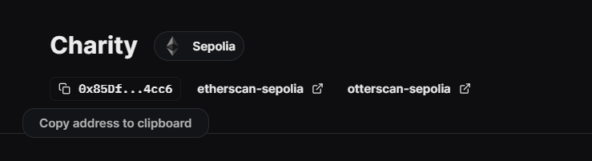

## Getting Started

Make sure you are not using old node version. For example, we are using node version 20. You can use the following command.

```bash
nvm use 20
```
Before building the project, you need to download hardhat locally, run:

```bash
npm install --save-dev hardhat
```

## Building the project

After any changes to the contract, run:

```bash
npm run build
# or
yarn build
```

to compile your contracts. This will also detect the [Contracts Extensions Docs](https://portal.thirdweb.com/contractkit) detected on your contract.

## Deploying Contracts

When you're ready to deploy your contracts, just run one of the following command to deploy you're contracts:

```bash
npm run deploy
# or
yarn deploy
```

After deploying the contract, copy the private key of your wallet and create a .env file, write the following in .env file:

```bash
PRIVATE_KEY=your private key
```

You will also need to update the contract address in /frontend/src/context/index.jsx line 9. New contract address can be found in thirdweb website after deploy. 

```bash
const { contract } = useContract('contract address');
```



## Releasing Contracts

If you want to release a version of your contracts publicly, you can use one of the followings command:

```bash
npm run release
# or
yarn release
```

## Front-end 

Now, open the frontend folder, run:

```bash
cd frontend
npm install
npm run dev
```

Finally, you can open "localhost:5173/" to run the project.
